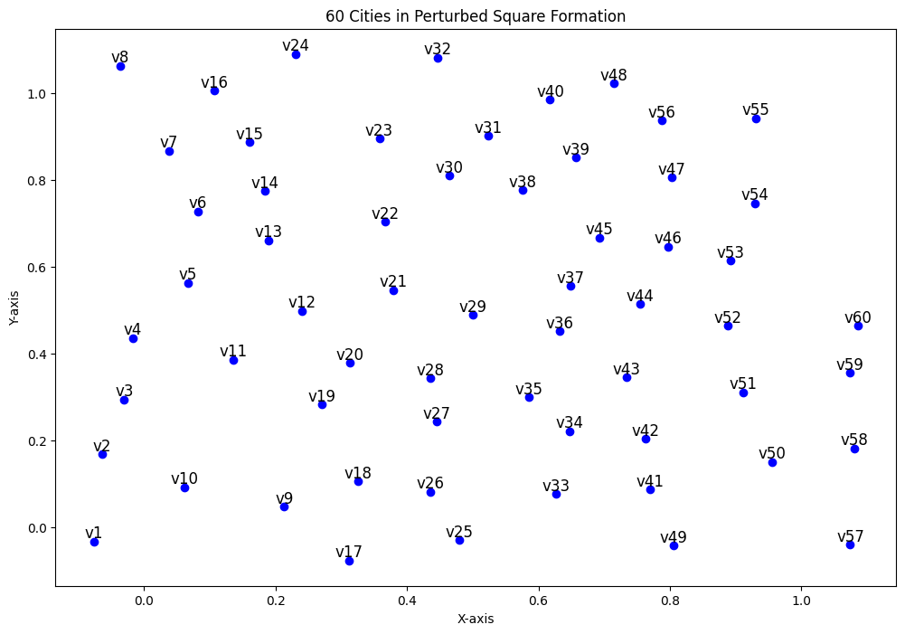
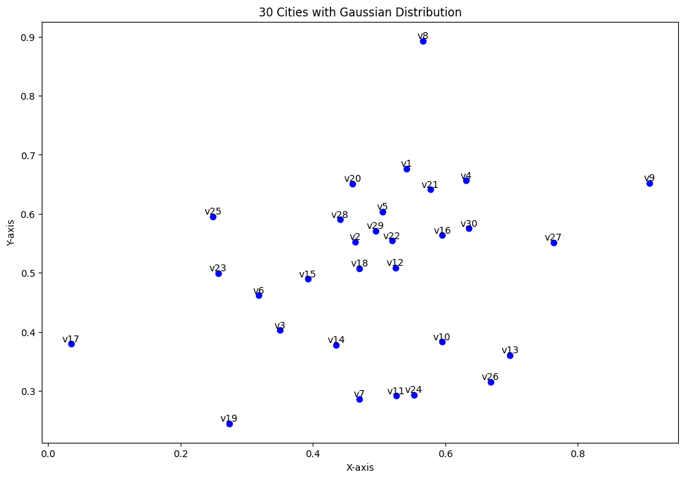
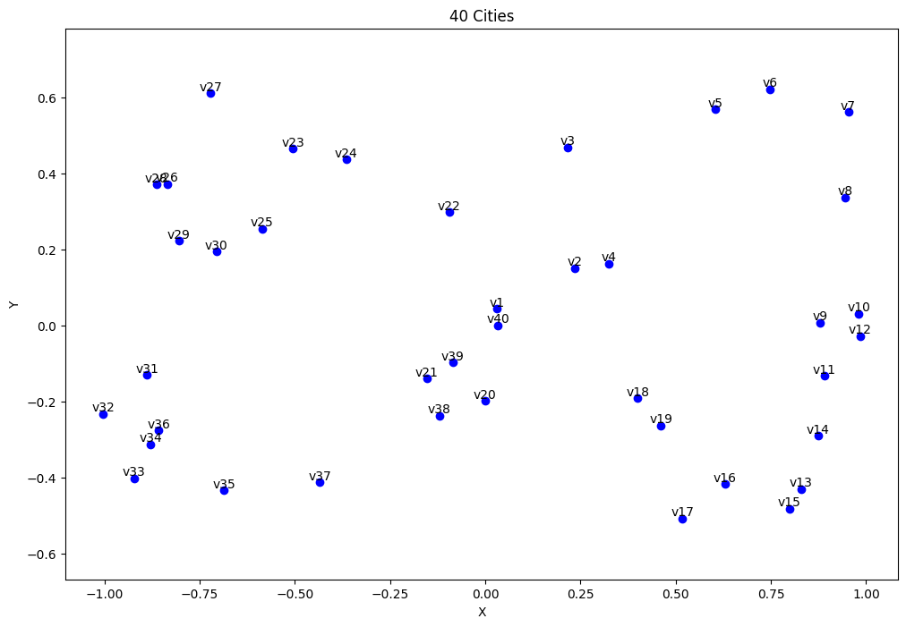
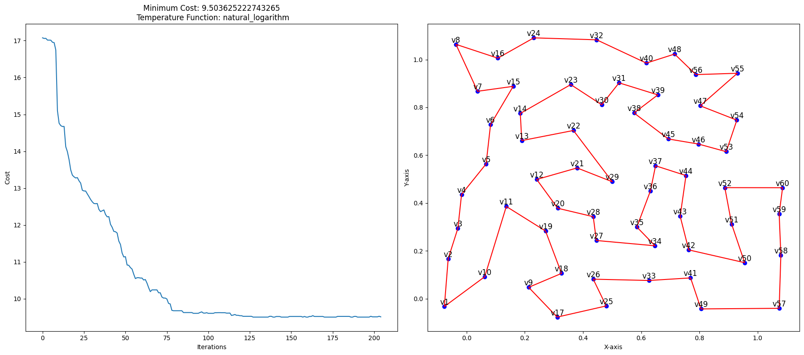
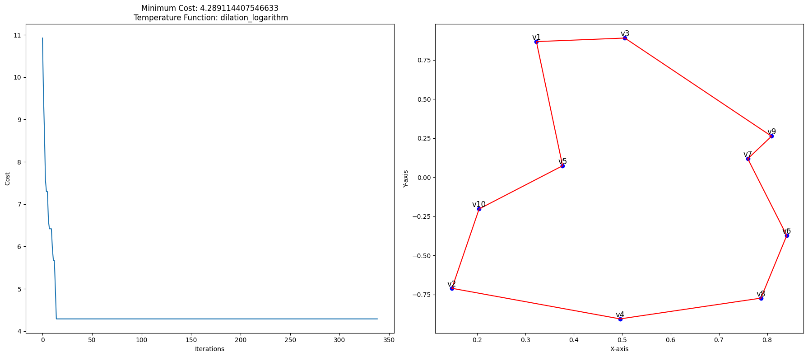
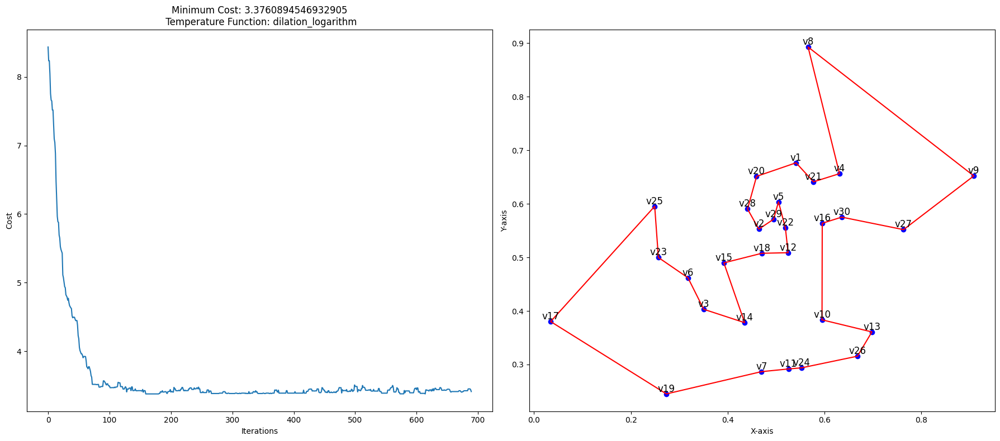
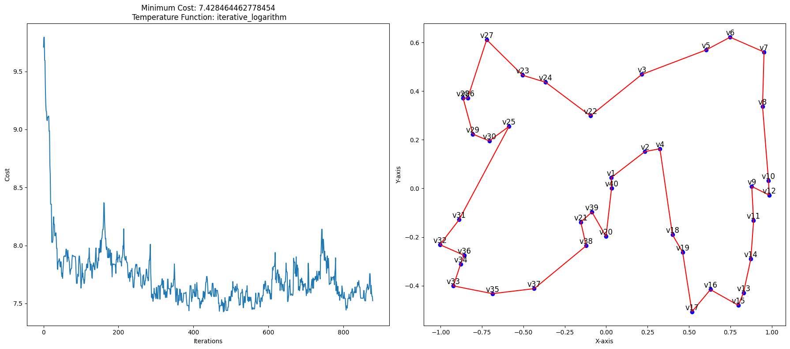

# Traveling salesman problem solver sing Simulated Annealing

 This project aims to solve the Traveling Salesman Problem (TSP) using Simulated Annealing, an optimization algorithm inspired by the annealing process in metallurgy. The TSP involves finding the shortest possible route that visits each city exactly once and returns to the origin city. Simulated Annealing is used to explore and optimize the solution space efficiently.

## The process

1. Generating Town Configurations: Generating random town configurations, including square, gaussian, circle, and infinite configurations. Each configuration provides a different layout of towns, contributing to a diverse exploration of the solution space.

2. Algorithm Development: After generating these configurations, I developed the Simulated Annealing algorithm. This algorithm is designed to optimize the route for the Traveling Salesman Problem by iteratively exploring and adjusting the route based on temperature functions and acceptance probabilities."

## Simulated Annealing Algorithm

Let $E$ be a finite set, and $H: E \to \mathbf{R}$ be a function for which we seek a minimum. We consider a Gibbs measure parametrized by $T > 0$ of the form

$$
  \mu_T(x) = \frac{1}{Z_T} \exp \bigl(- \frac{H(x)}{T} \bigr),
$$

where $Z_T$ is the normalization constant often called the partition function. As $T$ approaches $0$, the measure $\mu_T$ concentrates on the set of minima of $H$. Therefore, we consider a deterministic sequence $(T_n)_{n \ge 1}$ approaching $0$, and the Metropolis algorithm (inhomogeneous) as follows:

$$
  Q_n(x, y) = \begin{cases} 
    P(x, y) \exp \Bigl( - \frac{(H(y) - H(x))_+}{T_n} \Bigr)
    & \text{if $x \neq y$} \\
    1 - \sum_{z \neq x} Q_n(x, z) & \text{if $x = y$}.
  \end{cases}
$$

Here, $P$ is an _irreducible symmetric stochastic matrix_.

## Traveling Salesman Problem

The statement of the Traveling Salesman Problem (TSP) is as follows: given $N$ points (called "cities") and the distances between each point, find a path of minimal total length that passes exactly once through each point and returns to the starting point. The distance considered here is the Euclidean distance.

Let $N$ fixed cities be represented by a vector $V = (V_1, \dots, V_N) \in ([0,1]^2)^N$. Each component of this vector $V$ is the coordinate of a city in $[0,1]^2$, and the Euclidean distance $d$ between two cities $V_i$ and $V_j$ is denoted as $d(V_i, V_j)$. A route is identified by a permutation of $\{1,\dots,N\}$.

Thus, $E = \mathcal{S}_N$ is the set of permutations of $\{1,\dots,N\}$, and $H$, called the length of a route $x \in E$, is defined by

$$
  \forall x \in E, \quad H(x) 
  = \sum_{i=1}^{N-1} d \bigl(V_{x_i}, V_{x_{i+1}} \bigr)
  + d \bigl(V_{x_N}, V_{x_{1}} \bigr)
$$

For your information, there are $\operatorname{Card}\big(H(E)\big) = \frac{N !}{2 N}$ possible route lengths.

## Results

### The cost evolution over iterations and the optimal path on a map, with cities connected in the order of the optimal sequence

